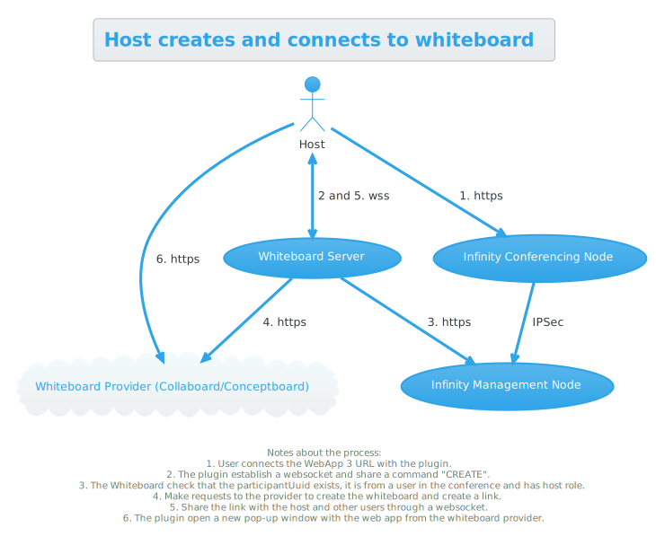
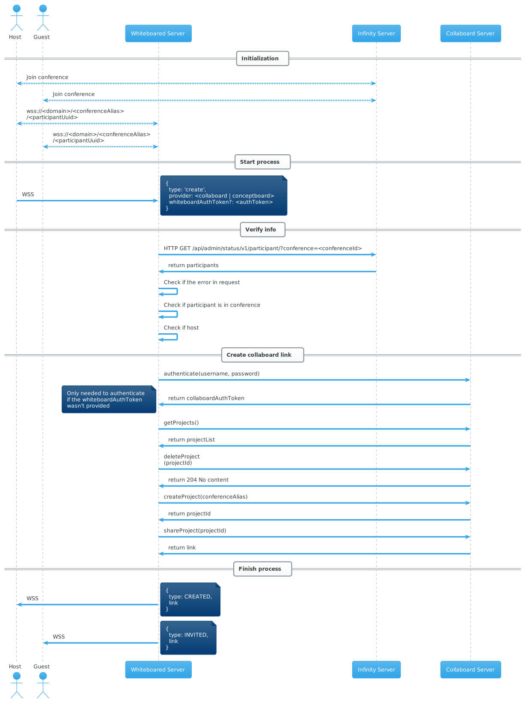

# Pexip Whiteboard: Development



## Server

This service communicates with the Web App 3 plugin through a WebSocket. The URL structure for the WebSocket endpoint is the following:

    /ws/<conference>/<participant_uuid>

And this is the structure of the messages:

```json
{
  "type": <MessageType>,
  "body": <Optional message>
}
```

The `MessageType` can be one of the following:

- `create`: It's used to indicate that this user wants to create a whiteboard and share the link with the rest of the user of the conference. The body in this case is empty.
- `created`: Indicates that the user created a whiteboard. The body contains a string with the link to the whiteboard.
- `invited`: Indicates that the user received a invitation for a whiteboard from another user. The body contains a string with the link to the whiteboard.
- `error`: This is used to indicate that something went wrong with the whiteboard creation. The message body will contain a string with the error description. 

Once somebody tries to share the whiteboard, it performs the following tasks:

- Verify that the `conference` exists.
- Verify that the `participant_uuid` is a member of the conference.
- Verify that the `participant_uuid` has the role `host`.
- Remove a whiteboard for `conference` if exists, since we want to start with a blank whiteboard.
- Create a whiteboard for `conference`.
- Create a link to share the whiteboard.
- Share the link through WebSocket with all the connected users of the same `conference`.  

## Sequence diagram



## How to create diagram

```bash
$ cd utils
$ java -jar plantuml-1.2023.11.jar -tsvg ../diagrams/*.puml -o ../diagrams/img
```